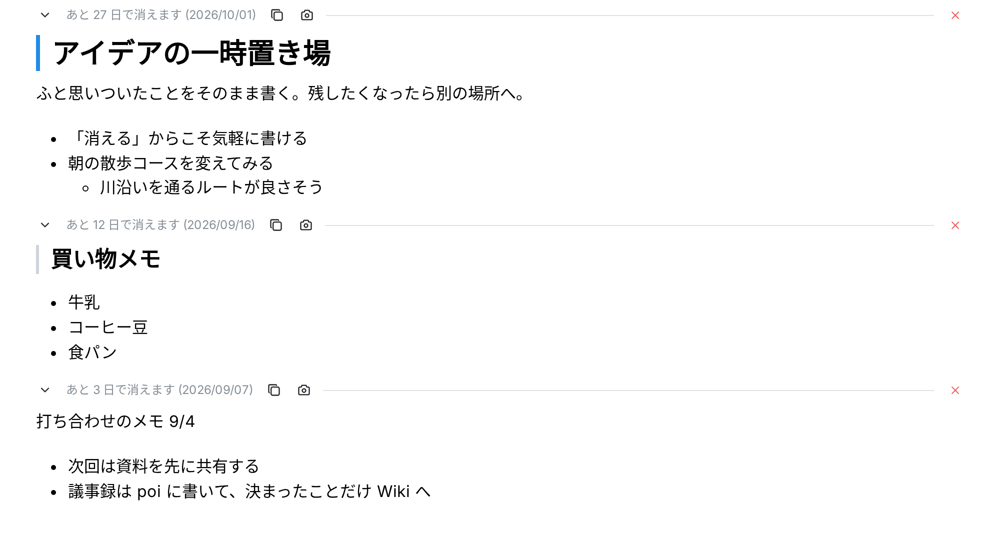

# poi

> 書いたことを忘れてくれるメモ帳。書いてから 30 日で全部消えます。

[English README](./README.md)

**poi** (ぽい) は「しばらくの間だけ必要なもの」のための 1 枚のメモ帳です。Google アカウントでログインすると
自分の板が 1 枚あり、書いたそばから自動保存され、セクションごとに書いてから 30 日で消えます。
**[poinote.app](https://poinote.app/) で使えます** (アプリの紹介もランディングページへ)。

このリポジトリがアプリの全体です。Cloudflare Worker 1 つと D1 だけで動くので、無料枠で自分用にセルフホストできます。



1 画面に要点だけ: セクションは空行 2 つ (かボタン) で分かれてそれぞれ期限切れになり、毎時の Cron が物理削除する。
編集中も Markdown ソースのまま見出し・箇条書き・URL がその場で装飾され (iA Writer 風)、それ以外の記法は
文字のまま表示されるので `*` や `>` でメモが崩れない。セクションはコピー / PNG 化 / 区切り線への折り畳みができ、
PWA としてインストールすればオフラインでも前回の板を読める。

## 技術スタック

| 層             | 選択                                                                      |
| -------------- | ------------------------------------------------------------------------- |
| ランタイム     | [Cloudflare Workers](https://workers.cloudflare.com/) + [D1](https://developers.cloudflare.com/d1/) (SQLite) + Cron Triggers |
| API            | [Hono](https://hono.dev/) (型付き RPC クライアント) + [Zod](https://zod.dev/) |
| 認証           | [Better Auth](https://www.better-auth.com/) (Google OAuth)                 |
| DB             | [Drizzle ORM](https://orm.drizzle.team/) + drizzle-kit マイグレーション    |
| フロントエンド | React 19, [TanStack Router](https://tanstack.com/router), [Mantine](https://mantine.dev/), [react-markdown](https://github.com/remarkjs/react-markdown), [CodeMirror 6](https://codemirror.net/) (エディタ) |
| ビルド         | [Vite](https://vite.dev/) + `@cloudflare/vite-plugin` + `vite-plugin-pwa`  |

## セルフホスト

### 前提

- Node.js 24 (`.node-version` 参照)
- [Cloudflare](https://dash.cloudflare.com/) アカウント (無料枠で可)
- Google OAuth 2.0 クライアント: [Google Cloud Console](https://console.cloud.google.com/apis/credentials) で
  **OAuth クライアント ID → ウェブ アプリケーション** を作成し、クライアント ID / シークレットを控える。
  リダイレクト URI は後の手順で追加する

### ローカルで動かす

```sh
git clone https://github.com/naosuke884/poi.git
cd poi
npm install
cp .dev.vars.example .dev.vars   # BETTER_AUTH_SECRET / GOOGLE_CLIENT_ID / GOOGLE_CLIENT_SECRET を設定
npm run db:migrate:local         # ローカル D1 にマイグレーション適用
npm run dev                      # http://localhost:5173
```

OAuth クライアントの **承認済みのリダイレクト URI** に `http://localhost:5173/api/auth/callback/google` を追加する。

開発サーバーは workerd 上で Worker とローカル D1 も動かすので、認証 / API / Cron ハンドラまでローカルで動く。
Service Worker は dev では登録されないので、PWA の挙動はビルドしてプレビューで確認する。

### Cloudflare にデプロイ

初回は 1〜7 をすべて、2 回目以降は 7 だけでよい。

1. Cloudflare にログイン
   ```sh
   npx wrangler login
   ```
2. D1 を作成し、出力された `database_id` を `wrangler.jsonc` の `d1_databases[0].database_id` に貼る。
   リポジトリに入っている値はメンテナのアカウントのものなので、そのままでは使えない
   ```sh
   npx wrangler d1 create poi
   ```
3. 本番 D1 にマイグレーションを適用
   ```sh
   npm run db:migrate:remote
   ```
4. Secrets を登録 (`.dev.vars` と同じ名前。値はリポジトリに入れない)
   ```sh
   openssl rand -base64 32 | npx wrangler secret put BETTER_AUTH_SECRET
   npx wrangler secret put GOOGLE_CLIENT_ID
   npx wrangler secret put GOOGLE_CLIENT_SECRET
   ```
5. Google の OAuth クライアントに本番のリダイレクト URI `https://<本番ドメイン>/api/auth/callback/google` を追加する。
   カスタムドメインを設定しなければ `poi.<account>.workers.dev`
6. ドメイン: `wrangler.jsonc` にはメンテナのカスタムドメイン (`routes`) と `workers_dev: false` が入っている。
   自分のドメインに書き換える (ゾーンが同じ Cloudflare アカウントにあること) か、`routes` を消して
   `workers_dev: true` にして `poi.<account>.workers.dev` で公開する。
7. ビルドしてデプロイ
   ```sh
   npm run deploy
   ```

デプロイ後、`https://<本番ドメイン>/` を開くとランディングページが表示され、Google でログインできる。
未ログインで `GET /api/board` は `401`。Workers のログに毎時 `[memo sweep] deleted N ...` が出る。

<details>
<summary>補足</summary>

- `BETTER_AUTH_URL` は省略可。未設定ならリクエストの origin が使われるので、`workers.dev` とカスタムドメインの両方で
  ログインできる。1 つの origin に固定したいときだけ `wrangler secret put BETTER_AUTH_URL` で設定する
- `/terms` と `/privacy` (`src/routes/terms.tsx`, `src/routes/privacy.tsx`) はメンテナ自身の利用規約・プライバシーポリシーで、
  問い合わせ先もこのリポジトリの Issue になっている。他の人に使わせるなら自分のものに書き換える
  (Google OAuth の同意画面にも `/privacy` を登録する)。
- `wrangler.jsonc` は `wrangler deploy` 時にも読まれるので、`database_id` は必ず本物にする
  (ダミーのままだと `binding DB ... database_id not found` で失敗する)
</details>

### GitHub Actions からデプロイする

`.github/workflows/deploy.yml` が `main` への push ごとにデプロイする (typecheck → build → D1 マイグレーション → `wrangler deploy`)。
job はリポジトリ変数でガードされているので **既定では何もしない**。fork しただけでは動かない。

上記 1〜6 を済ませたうえで、**Settings → Secrets and variables → Actions** に次を登録すると有効になる。

| 種類     | 名前                    | 値                                                                                         |
| -------- | ----------------------- | ------------------------------------------------------------------------------------------ |
| Variable | `ENABLE_DEPLOY`         | `true`                                                                                     |
| Secret   | `CLOUDFLARE_API_TOKEN`  | Cloudflare → My Profile → API Tokens。テンプレート「Edit Cloudflare Workers」に **D1: Edit** を足す |
| Secret   | `CLOUDFLARE_ACCOUNT_ID` | Cloudflare → Workers & Pages の右側に表示される Account ID                                  |

Worker の Secrets (手順 4) はそのまま使われるので、GitHub 側に登録するのは上の 3 つだけ。
無効に戻すときは `ENABLE_DEPLOY` を削除するか `true` 以外にする。

## 開発

| コマンド                    | 内容                                                          |
| --------------------------- | ------------------------------------------------------------- |
| `npm run dev`               | 開発サーバー (Vite + workerd 上で Worker / ローカル D1)        |
| `npm run typecheck`         | `wrangler types` で `Env` を生成してから `tsc --build`         |
| `npm run build`             | `dist/client` (アセット) と `dist/poi` (Worker) をビルド      |
| `npm run preview`           | ビルド後、本番相当の環境でプレビュー                           |
| `npm run deploy`            | ビルドして `wrangler deploy`                                   |
| `npm run db:generate`       | スキーマ差分からマイグレーション SQL を生成 (`drizzle/`)       |
| `npm run db:migrate:local`  | ローカル D1 にマイグレーション適用                              |
| `npm run db:migrate:remote` | 本番 D1 にマイグレーション適用                                  |
| `npm run auth:schema`       | Better Auth の設定から `worker/db/schema.ts` を再生成          |

CI (`.github/workflows/ci.yml`) が PR ごとに `npm run typecheck && npm run build` を実行する。

```
src/        React SPA (TanStack Router のルート、Board コンポーネント、オフライン / PWA まわり)
worker/     Hono API、Better Auth、Drizzle スキーマ、期限切れセクションを消す Cron
drizzle/    マイグレーション SQL
public/     PWA アイコン
```

板エディタ、`/api/board` の仕様、期限切れ削除の Cron、PWA のキャッシュ、オフライン時の挙動などの詳細は、
それぞれのファイル冒頭のコメント (`src/components/Board.tsx`、`src/components/SectionEditor.tsx`、
`src/lib/section-markdown.ts`、`worker/memo/routes.ts`、`worker/memo/sweep.ts`、
`vite.config.ts`、`src/routes/index.tsx`) に書いてある。

## コントリビュート

バグ報告・提案・Pull Request を歓迎します。[CONTRIBUTING.md](./CONTRIBUTING.md) を参照してください。
脆弱性は [SECURITY.md](./SECURITY.md) の手順で非公開に報告してください。

## ライセンス

[MIT](./LICENSE) © Hayashi Naoki
